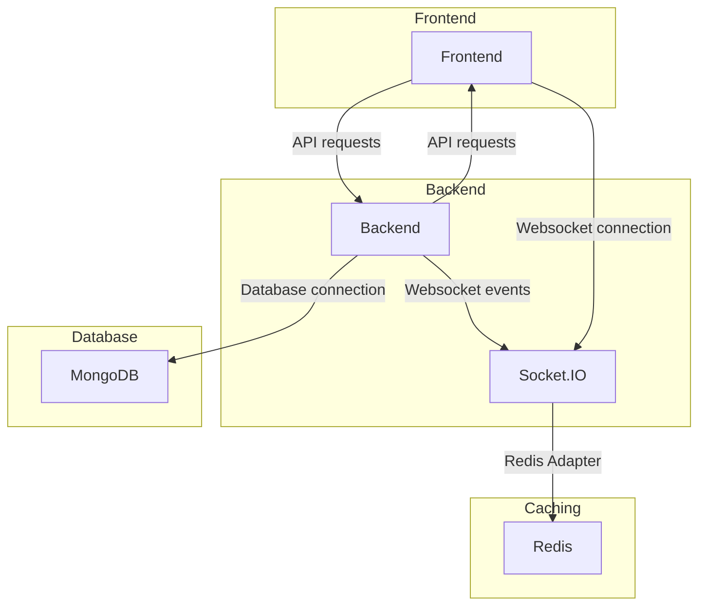

# Full stack aplication for trip managing website
*This is a learning project mostly in backend and docker but also in frontend and connecting services*  
*For more in depth info go to [backend](backend/README_backend.md) or [frontend](frontend/README_frontend.md)*

## Table of Contents

- [Introduction](#Introduction)
- [Features](#features)
- [Installation](#installation)
- [Usage](#usage)
- [Technologies Used](#technologies-used)
- [Architecture](#architecture)
- [Development Workflow](#development-workflow)
- [API Documentation](#api-documentation)
- [Docker containers](#docker-containers)
- [Structure](#structure)  
- [Contributing](#contributing)
- [License](#license)
- [Project Status and Roadmap](#project-status-and-roadmap)
- [Reporting Issues](#reporting-issues)
- [External Services](#external-services)

## Introduction
This project is primarily a learning exercise, focusing on reusability and readability.


## Features
- User authentication (registration, login, logout)
- Email verification for new accounts
- Password recovery via email
- Trip creation and management
- Collaborative trip editing in real-time
- Sharing trips (view-only or editable)
- User profile management (change profile picture, change password)
- Google Maps integration for place selection

## Installation
``` bash
git clone https://github.com/Radoslaw-Wolnik/Trip-Planning-Full-Stack.git Trip-Planning
cd Trip-Planning/backend
npm install
cd ../frontend
npm install
```

## Usage
<details>
<summary>

#### setting env variables:
</summary>

``` bash
# /main-dir/.env:
MONGO_INITDB_ROOT_USERNAME=root
MONGO_INITDB_ROOT_PASSWORD=rootpassword
MONGO_INITDB_DATABASE=mydatabase
MONGO_INITDB_USER=myuser
MONGO_INITDB_PASSWORD=mypassword

# /main-dir/frontend/.env:
VITE_API_URL=http://localhost:5000/api
VITE_GOOGLE_MAPS_API_KEY=your-google-maps-key

# /main-dir/backend/.env.development:
DB_HOST=mongo:27017
DB_NAME=mydatabase
DB_USER=myuser
DB_PASS=mypassword

JWT_SECRET=mysecret
PORT=5000
FRONTEND=http://localhost:5173
SOCKET_URL=http://socketio:5001
REDIS_URL=redis://redis:6379

EMAIL_HOST=service-stmp-link
EMAIL_PORT=service-port
EMAIL_USER=your_service_username
EMAIL_PASS=your_secret_key
EMAIL_FROM=verified_email
```
</details>

#### docker-compose
```bash
cd Trip-Planning
docker-compose up --build
docker-compose exec backend node seed.js
```

#### if in trouble, purge and restart  
mostly if some modules are not installed by docker but they are in your package-lock.json
```bash
docker-compose down -v             # removes all volumes
docker-compose build --no-cache    # build without cache
docker-compose up --force-recreate # force recreate
```

#### build of only one container
```bash
docker build -t frontend-app . # not surre will check
```


## Technologies Used
- **Backend:** Node.js, Express, ES6 modules
- **Frontend:** React (with Vite), TypeScript
- **Database:** MongoDB
- **Real-time Communication:** Socket.IO
- **Caching:** Redis
- **Containerization:** Docker

## Architecture



## Development Workflow

1. Fork the repository
2. Create a new branch for your feature
3. Implement your changes
4. Write or update tests as necessary
5. Run tests: `npm test`
6. Commit your changes using conventional commit messages
7. Push to your fork and submit a pull request

We use Git for version control and follow the GitFlow workflow.

## API Documentation

Go [here](backend/API_documentation.md) for API documentation

## Docker Containers:
 - **redis** - for better communication between containers (rn socketio and backend)
 - **mongoDB** - database curren schemas User, Trip and ExpiredTokens
 - **socketio** - the realtime communication, could be part of backend but for practice it's not
 - **backend** - server
 - **frontend** - client


## Project Structure
<details>
<summary>see structure tree</summary>

```bash
  main-dir/
  ├── backend/
  │   ├── node_modules/
  │   │   ├── ...
  │   │   └── ...
  │   ├── src/
  │   │   ├── app.js
  │   │   ├── server.js
  │   │   ├── ...
  │   │   └── ...
  │   ├── uploads/
  │   │   ├── ...
  │   │   └── ...
  │   ├── .env.development
  │   ├── .env.production
  │   ├── Dockerfile
  │   ├── Dockerfile.socketio
  │   ├── init-mongo.js
  │   ├── nodemon.json
  │   ├── package-lock.json
  │   ├── package.json
  │   ├── populateDB.js
  │   └── README_backend.md
  ├── frontend/
  │   ├── build/
  │   │   ├── ...
  │   │   └── ...
  │   ├── node_modules/
  │   │   ├── ...
  │   │   └── ...
  │   ├── public/
  │   │   ├── index.html - should be here but its not
  │   │   └── ...
  │   ├── src/
  │   │   ├── index.css
  │   │   ├── App.js
  │   │   ├── main.tsx            
  │   │   ├── ...
  │   │   └── ...
  │   ├── .eslintrc.js
  │   ├── Dockerfile
  │   ├── index.html
  │   ├── package-lock.json
  │   ├── package.json
  │   ├── tsconfig.json
  │   ├── tsconfig.node.json
  │   ├── vite.config.ts
  │   └── README_frontend.md
  ├── .dockerignore
  ├── .env
  ├── .gitgnore
  ├── docker-compose-prod.yml
  ├── docker-compose.yml
  ├── LICENSE
  └── README.md
  ```

  ### Key takes:
  - each component have its own Dockerfile: /backend/Dockerfile and /backend/Dockerfile.socketio and /frontend/Dockerfile
  - docker-compose: creates services, currentyly: redis, mongoDB, socketio, backend, frontend
  - nodemon track changes in files for dev purposes (package.json)
  - global gitgnore and dockerignore must have
  - the env files that currently are not best structured but should be: /backend/.env and /frontend/.env and /.env for docker-compose.yml
  - to see the .env contest go to /backend/src/config/enviorement.js, same for frontend, the only one not visible is /.env and idk if it should
  - for more in depth explonation go to /frontend/README or /backend/README
  - as per docker-compose we make volumes that mount directly from ... and persist across the builds of containers (so the data from the db is not removed when deleting the containers)
</details>

------------------------------------
## Contributing
This project is primarily a personal learning exercise. However, if you spot any bugs or have suggestions for improvements, feel free to open an issue or submit a pull request.  

If you'd like to contribute:

1. Fork the repository
2. Create your feature branch (git checkout -b feature/AmazingFeature)
3. Commit your changes using conventional commit messages
4. Run tests: npm test
5. Push to the branch (git push origin feature/AmazingFeature)
6. Open a Pull Request

We use Git for version control and follow the GitFlow workflow. Please ensure your code adheres to the project's coding standards and conventions.  

Your pull requests will be reviewed, and there may be a delay in merging due to the personal nature of this project. However, we appreciate all contributions that help improve the codebase and enhance the learning experience.

## Licence
This project is licensed under the MIT License - see the [LICENSE](LICENSE.md) file for details.

## Project Status and Roadmap

Current Status: In active development

Roadmap:
- Implement user dashboard
- Add trip statistics and analytics
- Integrate with more external APIs for place information
- Improve mobile responsiveness

## Reporting Issues

If you encounter any bugs or have feature requests, please open an issue on the GitHub repository. Provide as much detail as possible, including steps to reproduce the issue and your environment details.

## External Services

This project relies on the following external services:
- Google Maps API for place selection and mapping
- Brevo for email services

Please ensure you have the necessary API keys and configurations for these services when setting up the project.


## TODO:
- [ ] deployment

- [ ] how to build only one container
- [ ] change names of containers and mby links (localhost to server, client etc)

## Special Thanks:
 - **claude.ai** - by Anthropic - much better at explaining code then my uni profs
 - **brevo** - for free tier of 200 emails/day
 - **yt** - ofc

